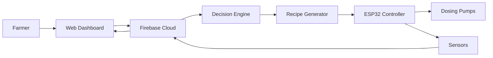
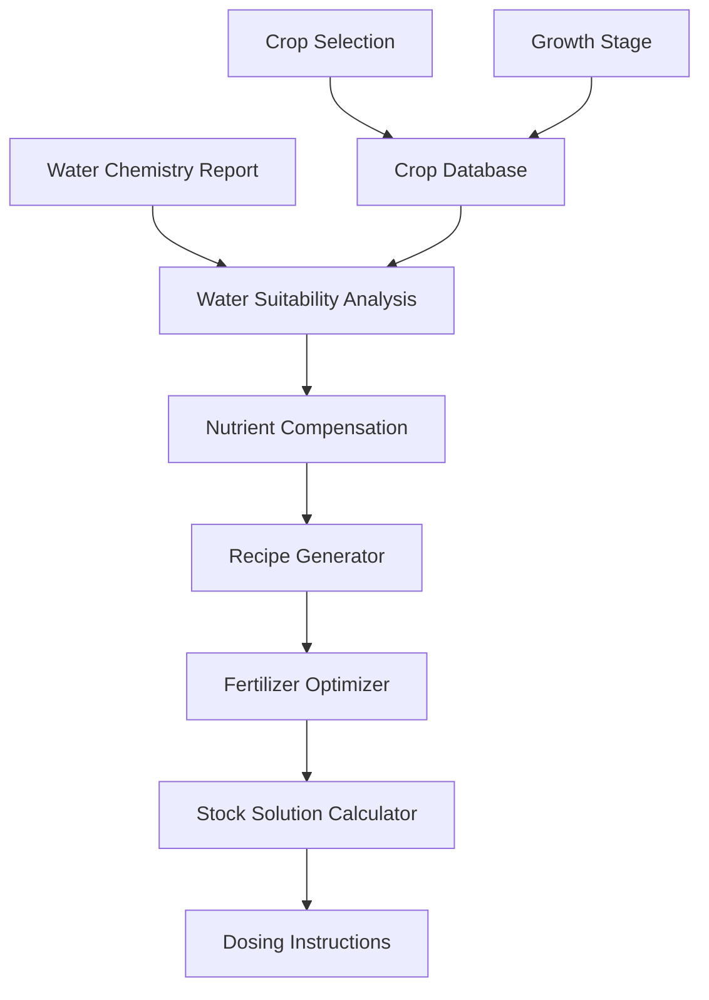
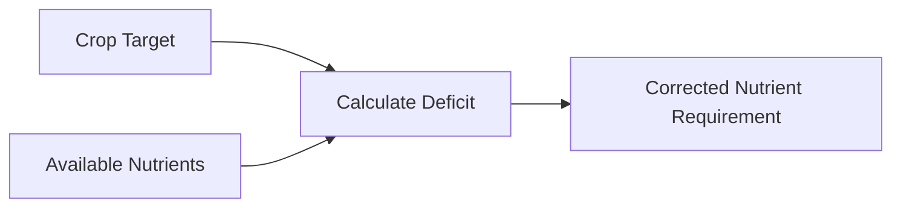
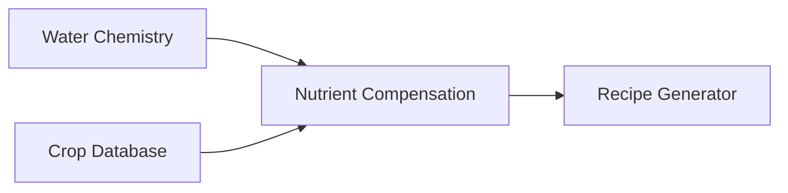
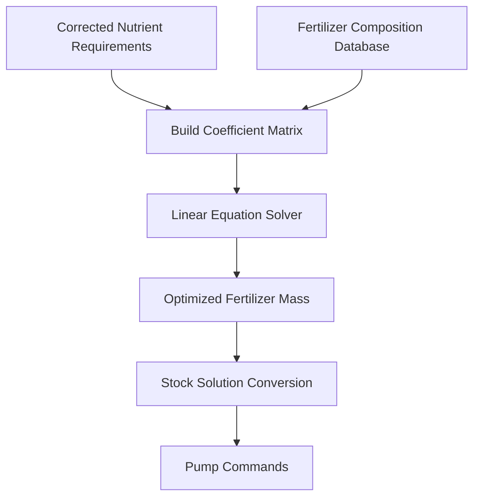
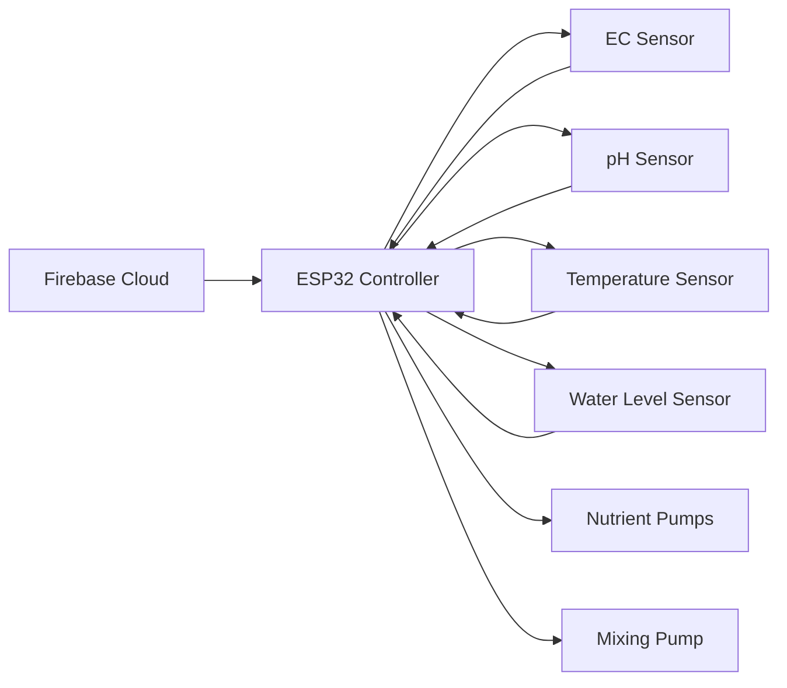
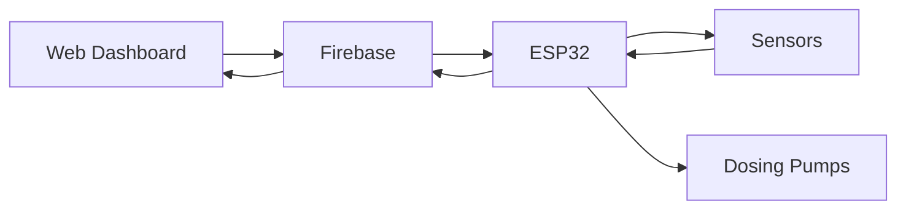
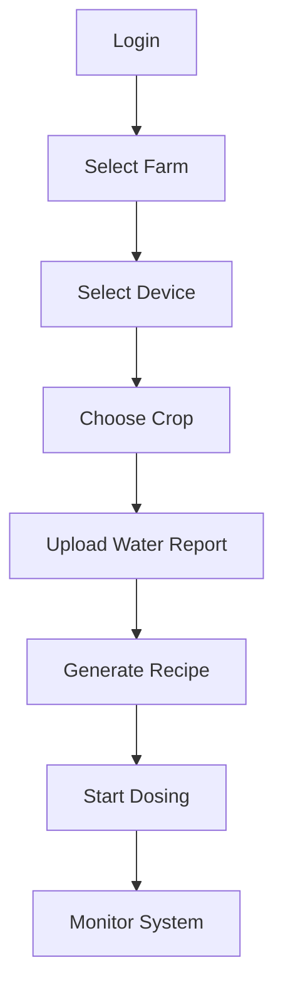
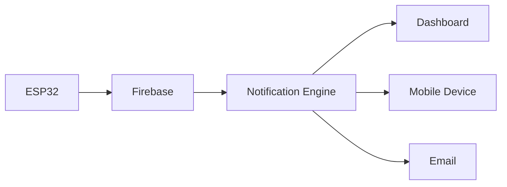

<div align="center">

# 🌱 HydroLogic

### Intelligent Hydroponic Nutrient Management Platform

<p align="center">

An AI-assisted hydroponic platform that analyzes water chemistry, generates crop-specific nutrient recipes, automates nutrient dosing, and provides real-time cloud monitoring for precision agriculture.

</p>

<p align="center">


</p>

<p align="center">


</p>

---

### 🌿 Precision Agriculture • Artificial Intelligence • IoT • Cloud Computing

*"Making hydroponic nutrient management intelligent, automated and data-driven."*

</div>

---

# 📖 Overview

HydroLogic is an intelligent hydroponic nutrient management platform designed for modern controlled-environment agriculture.

Unlike conventional hydroponic controllers that rely only on Electrical Conductivity (EC) and pH, HydroLogic evaluates complete water chemistry, compensates for naturally available nutrients, generates optimized fertilizer recipes, and automates nutrient dosing through an IoT-enabled control system.

The platform combines:

- 🧠 Intelligent Decision Engine
- 🌱 Crop-Specific Nutrient Intelligence
- 💧 Water Chemistry Analysis
- ⚙ Automated Fertilizer Dosing
- ☁ Firebase Cloud Integration
- 📊 Real-Time Monitoring
- 📱 Remote Dashboard
- 📈 Historical Analytics

---

# 🎯 Why HydroLogic?

Traditional hydroponic controllers typically measure only:

- Electrical Conductivity (EC)
- pH

These measurements indicate the total concentration of dissolved ions but **cannot identify which nutrients are present**.

For example, two water sources may have the same EC while containing completely different mineral compositions.

HydroLogic goes beyond EC by answering questions such as:

- Is this water suitable for the selected crop?
- Which nutrients are already available?
- Which nutrients are deficient?
- Which fertilizers should be added?
- How much fertilizer is actually required?
- Is water treatment recommended before use?

This enables more accurate nutrient management while reducing fertilizer waste.

---

# ✨ Key Features

- 🌱 Crop-specific nutrient recipes
- 🌿 Growth stage-based nutrient management
- 💧 Water suitability analysis
- ⚖ Nutrient compensation using water chemistry
- 🧮 Matrix-based fertilizer optimization
- ⚙ Automatic nutrient dosing
- 📊 EC and pH monitoring
- 📈 Historical analytics
- ☁ Firebase cloud synchronization
- 📱 Web dashboard
- 🔔 Smart notifications
- 👥 Multi-user support
- 🏡 Multi-farm management
- 🔄 OTA firmware updates

---

# 🚀 System Architecture



---

# 🔄 Complete Platform Workflow


---

# 💡 Core Workflow

```text
             Water Chemistry Report
                      │
                      ▼
          Water Suitability Analysis
                      │
                      ▼
            Crop & Growth Stage
                      │
                      ▼
          Nutrient Deficit Calculation
                      │
                      ▼
        Fertilizer Recipe Generation
                      │
                      ▼
      Stock Solution Volume Calculation
                      │
                      ▼
            ESP32 Dosing Controller
                      │
                      ▼
             Reservoir Mixing
                      │
                      ▼
           EC & pH Verification
                      │
                      ▼
           Cloud Data Synchronization
                      │
                      ▼
          Dashboard & Mobile App
```

---

# 🌾 Supported Crop Categories

HydroLogic currently supports multiple crop families.

| Category | Example Crops |
|-----------|---------------|
| Leafy Greens | Lettuce, Spinach, Kale |
| Herbs | Basil, Mint, Parsley |
| Fruiting Crops | Tomato, Eggplant |
| Vining Crops | Cucumber, Melons |
| Peppers | Bell Pepper, Chilli |
| Root Crops | Carrot, Beetroot |
| Berries | Strawberry |
| Tropical Crops | Banana, Pineapple |

Each crop profile contains:

- Growth stages
- Target nutrient profile
- Target EC
- Target pH
- Environmental conditions
- Nutrient uptake requirements

---

# 🔧 Hardware Components

| Component | Purpose |
|------------|---------------------------|
| ESP32 | Main Controller |
| EC Sensor | Nutrient Concentration |
| pH Sensor | Acidity Measurement |
| Water Temperature Sensor | Temperature Monitoring |
| Water Level Sensor | Reservoir Volume |
| Peristaltic Pumps | Nutrient Dosing |
| Mixing Pump | Solution Mixing |
| Solenoid Valve | Water Control |

---

# 📂 Repository Structure

```text
HydroLogic
│
├── ai_engine
├── dashboard
├── firmware
├── mobile_app
├── firebase
├── docs
│   ├── algorithms
│   ├── architecture
│   ├── assets
│   ├── hardware
│   └── api
│
├── datasets
├── simulations
└── README.md
```

---

# 🌍 Commercial Ecosystem

HydroLogic is the open technical platform that provides the core nutrient intelligence, optimization algorithms, and embedded control system.

**ORIVA** is a commercial implementation built using HydroLogic, providing product branding, deployment tools, customer management, and commercial services.

---
---

# 🧠 Intelligent Decision Engine

The Intelligent Decision Engine is the core software module responsible for transforming raw water chemistry data into an optimized hydroponic nutrient recipe.

Instead of relying solely on Electrical Conductivity (EC), HydroLogic evaluates the complete mineral composition of the source water, compares it with crop-specific nutrient requirements, calculates nutrient deficits, and generates an optimized fertilizer recipe.

The complete decision process is fully automated and consists of five independent modules.

---

# 🏗 Decision Engine Architecture



---

# 💧 Water Suitability Analysis

Before generating any fertilizer recipe, HydroLogic evaluates whether the uploaded water source is suitable for the selected crop.

Instead of considering only EC, the platform analyses individual dissolved minerals that directly influence nutrient availability and plant health.

---

## Parameters Analysed

| Parameter | Purpose |
|------------|------------------------------------|
| pH | Acidity / Alkalinity |
| EC | Initial dissolved salts |
| Calcium | Available Calcium |
| Magnesium | Available Magnesium |
| Potassium | Available Potassium |
| Sulfate | Sulfur Source |
| Nitrate | Available Nitrogen |
| Sodium | Harmful Salt Detection |
| Chloride | Toxicity Detection |
| Bicarbonate | Alkalinity Evaluation |

---

# Water Suitability Workflow


---

# Suitability Analysis Output

The analysis produces:

- Water Suitability Score
- Crop Compatibility Score
- Nutrient Availability Report
- Harmful Ion Warnings
- Water Treatment Recommendations

Example:

```text
Water Suitability : Excellent

Available Nutrients

✔ Calcium

✔ Magnesium

✔ Potassium

Warnings

⚠ Sodium slightly elevated

Recommendation

Blend with RO water if growing strawberries.
```

---

# 🌱 Crop Intelligence Module

Every crop inside HydroLogic contains an independent nutrient profile.

Each crop profile stores:

- Growth stages
- Target nutrient concentrations
- Target EC
- Target pH
- Recommended temperature
- Nutrient uptake characteristics

---

## Example Crop Profile

```text
Crop

Tomato

Growth Stage

Heavy Fruiting

Target Nutrients

Nitrogen      140 ppm

Phosphorus     50 ppm

Potassium     300 ppm

Calcium       170 ppm

Magnesium      65 ppm

Sulfur         80 ppm

Target EC

2.8–3.2 mS/cm

Target pH

5.8–6.2
```

---

# 📊 Nutrient Compensation

The uploaded water already contains dissolved minerals.

HydroLogic automatically subtracts these naturally available nutrients before preparing the fertilizer recipe.

This avoids unnecessary fertilizer addition and reduces operating cost.

---

## Example

Target Calcium

```text
170 ppm
```

Available Calcium

```text
120 ppm
```

Required Calcium

```text
170 − 120

=

50 ppm
```

The same calculation is performed for:

- Nitrogen
- Phosphorus
- Potassium
- Calcium
- Magnesium
- Sulfur

---

# Compensation Workflow



---

# 📋 Example Compensation Table

| Nutrient | Target (ppm) | Available (ppm) | Required (ppm) |
|-----------|-------------:|----------------:|---------------:|
| Nitrogen | 140 | 20 | 120 |
| Phosphorus | 50 | 5 | 45 |
| Potassium | 300 | 30 | 270 |
| Calcium | 170 | 120 | 50 |
| Magnesium | 65 | 40 | 25 |
| Sulfur | 80 | 20 | 60 |

The corrected nutrient requirements are then forwarded to the Recipe Generation Engine.

---

# 🎯 Why Nutrient Compensation Matters

Without nutrient compensation, conventional hydroponic systems add a fixed fertilizer recipe regardless of the minerals already present in the source water.

This often leads to:

- Excess fertilizer usage
- Nutrient imbalance
- Higher EC
- Increased operating costs
- Reduced crop quality

HydroLogic eliminates these issues by generating a **water-specific fertilizer recipe** for every reservoir.

---

# 🔄 Decision Engine Summary



The output of the Decision Engine is a corrected nutrient profile that serves as the input for the Fertilizer Optimization Engine.
---

# ⚗️ Recipe Generation Engine

The Recipe Generation Engine converts the corrected nutrient requirements into an optimized fertilizer recipe.

Unlike traditional nutrient calculators that calculate each fertilizer independently, HydroLogic treats the recipe generation problem as a **system of simultaneous linear equations**, ensuring that all nutrient targets are satisfied while minimizing dosing error.

This approach provides a mathematically optimized fertilizer combination for every reservoir.

---

# 🎯 Objective

The objective of the Recipe Generation Engine is to determine:

- Which fertilizers should be used.
- How much of each fertilizer is required.
- The exact pump volume to dispense from each stock solution.

---

# 📦 Supported Stock Solution Tanks

The system uses **eight dosing tanks**.

| Tank | Contents |
|------|---------------------------|
| Tank A | Calcium Nitrate |
| Tank B | Potassium Nitrate |
| Tank C | Monopotassium Phosphate (MKP) |
| Tank D | Magnesium Sulfate |
| Tank E | Potassium Sulfate |
| Tank F | Micronutrient Solution |
| Tank G | pH Up Solution |
| Tank H | pH Down Solution |

---

# 🌿 Fertilizer Composition Database

Each fertilizer contributes multiple nutrients.

| Fertilizer | N | P | K | Ca | Mg | S |
|------------|--:|--:|--:|---:|---:|---:|
| Calcium Nitrate | ✔ | — | — | ✔ | — | — |
| Potassium Nitrate | ✔ | — | ✔ | — | — | — |
| MKP | — | ✔ | ✔ | — | — | — |
| Magnesium Sulfate | — | — | — | — | ✔ | ✔ |
| Potassium Sulfate | — | — | ✔ | — | — | ✔ |
| Micronutrients | Trace Elements | | | | | |

---

# 🔄 Recipe Generation Workflow



---

# 📐 Matrix-Based Optimization

Each fertilizer contributes to more than one nutrient.

For example:

### Calcium Nitrate

Provides

- Nitrogen
- Calcium

### Potassium Nitrate

Provides

- Nitrogen
- Potassium

### MKP

Provides

- Phosphorus
- Potassium

Because of this, fertilizers cannot be calculated independently.

Instead, HydroLogic solves them simultaneously using matrix algebra.

---

# Mathematical Model

The fertilizer calculation is represented as

```
A × X = B
```

Where

**A**

Fertilizer composition matrix

**X**

Unknown fertilizer quantities

**B**

Required nutrient vector

The Linear Solver computes the fertilizer quantities that satisfy all nutrient requirements simultaneously.

---

# Example Matrix

```text
                Calcium   Potassium   MKP   MgSO₄   K₂SO₄

Nitrogen          0.155      0.138      0      0      0

Phosphorus        0           0        0.227   0      0

Potassium         0         0.387     0.287   0    0.449

Calcium         0.190         0         0      0      0

Magnesium         0           0         0    0.098    0

Sulfur            0           0         0    0.130  0.184
```

Each value represents the fraction of nutrient supplied by one gram of fertilizer.

---

# Example Nutrient Requirement

Suppose nutrient compensation produces the following corrected targets.

| Nutrient | Required (ppm) |
|-----------|---------------:|
| Nitrogen | 120 |
| Phosphorus | 45 |
| Potassium | 270 |
| Calcium | 50 |
| Magnesium | 25 |
| Sulfur | 60 |

For a **100 L reservoir**

```
Nitrogen

120 × 100

=

12000 mg

=

12 g
```

The same conversion is performed for every nutrient before solving the matrix.

---

# 🧮 Optimization Process

The optimization engine performs the following steps.

1. Load fertilizer composition database.

2. Convert nutrient requirements from ppm to grams.

3. Construct the coefficient matrix.

4. Solve the matrix using least-squares optimization.

5. Reject negative fertilizer quantities.

6. Validate nutrient error.

7. Generate optimized fertilizer recipe.

---

# 📊 Example Output

| Fertilizer | Required |
|------------|---------:|
| Calcium Nitrate | 31.8 g |
| Potassium Nitrate | 25.1 g |
| MKP | 19.7 g |
| Magnesium Sulfate | 25.6 g |
| Potassium Sulfate | 12.3 g |
| Micronutrients | 4.2 g |

These values represent the dry fertilizer required for the reservoir.

---

# 💧 Stock Solution Conversion

The dosing pumps deliver **liquid stock solutions**, not dry fertilizer.

Therefore, the calculated fertilizer masses must be converted into pump volumes.

Example

Required Calcium Nitrate

```
30 g
```

Stock Tank

```
1000 g dissolved in 10 L
```

Stock Concentration

```
1000 g

────────

10000 mL

=

0.1 g/mL
```

Pump Volume

```
30 g

──────

0.1 g/mL

=

300 mL
```

The same conversion is performed automatically for every dosing tank.

---

# ⚙ Pump Volume Formula

```
Pump Volume (mL)

=

Required Fertilizer (g)

────────────────────────

Stock Concentration (g/mL)
```

---

# 🚀 Final Recipe Output

The Recipe Generation Engine produces:

- Fertilizer quantities (grams)
- Stock solution volumes (mL)
- Pump commands
- Expected nutrient composition
- Reservoir preparation instructions

These outputs are transmitted to the ESP32 controller, which activates the corresponding dosing pumps.

---

# 📌 Why Matrix Optimization?

Traditional hydroponic calculators estimate fertilizers one by one, often creating nutrient imbalances because each fertilizer supplies multiple elements.

HydroLogic solves **all fertilizers simultaneously**, resulting in:

- ✔ Balanced nutrient composition
- ✔ Reduced dosing error
- ✔ Lower fertilizer waste
- ✔ Scalable to any crop profile
- ✔ Automatic adaptation to different reservoir sizes
- ✔ Compatibility with changing water chemistry

This mathematical approach enables precise and repeatable nutrient preparation for hydroponic systems.
---

# 📡 Embedded Control System

The embedded controller is responsible for executing the nutrient dosing commands generated by the Recipe Generation Engine.

An ESP32 microcontroller acts as the local edge device, continuously communicating with Firebase while controlling sensors and dosing hardware.

---

# ESP32 Responsibilities

- Read EC sensor
- Read pH sensor
- Read water temperature
- Read reservoir level
- Monitor nutrient tank levels
- Operate dosing pumps
- Control mixing pump
- Execute dosing schedules
- Synchronize data with Firebase
- Perform OTA firmware updates

---

# Embedded System Architecture



---

# ☁ Firebase Cloud Architecture

HydroLogic uses Firebase as the cloud backend for real-time synchronization between the dashboard and embedded controller.

Firebase provides:

- User Authentication
- Cloud Firestore
- Realtime Database
- Cloud Storage
- Cloud Functions
- Push Notifications
- Device Synchronization

---

# Firebase Data Structure

```text
Users
│
├── User_ID
│
├── Farms
│   ├── Farm_01
│   ├── Farm_02
│
├── Devices
│   ├── Device_001
│   ├── Device_002
│
├── Crop Profiles
│
├── Water Reports
│
├── Recipes
│
├── Sensor Logs
│
├── Dosing Logs
│
├── Notifications
│
└── Analytics
```

---

# Cloud Synchronization Workflow



---

# 🌐 Web Dashboard

The HydroLogic dashboard enables farmers to remotely monitor and manage hydroponic systems.

---

## Dashboard Features

- User Login
- Multi-Farm Management
- Device Registration
- Crop Selection
- Growth Stage Selection
- Water Report Upload
- Water Suitability Analysis
- Recipe Generation
- Reservoir Monitoring
- Sensor Monitoring
- Nutrient Tank Monitoring
- Historical Reports
- Analytics Dashboard
- Notification Center

---

# Dashboard Workflow



---

# 📊 Analytics Engine

HydroLogic continuously stores operational data to help farmers optimize crop production.

Analytics are generated automatically for multiple time periods.

---

## Reports

- Daily Report
- Weekly Report
- Monthly Report
- Crop Cycle Report

---

## Metrics

- Water Consumption
- Fertilizer Consumption
- EC Stability
- pH Stability
- Reservoir Refill Frequency
- Pump Runtime
- Sensor Health
- Nutrient Cost
- Estimated Yield Efficiency

---

# Sample Dashboard Metrics

| Metric | Description |
|---------|-------------|
| Current EC | Live nutrient concentration |
| Current pH | Live pH value |
| Water Temperature | Reservoir temperature |
| Reservoir Level | Current water volume |
| Tank Levels | Remaining stock solutions |
| Daily Water Usage | Water consumed today |
| Daily Fertilizer Usage | Nutrients consumed today |
| Total Pump Runtime | Pump operating hours |

---

# 🤖 AI Insights

HydroLogic uses collected operational data to generate intelligent recommendations.

Examples include:

- Predict nutrient depletion dates.
- Estimate refill intervals.
- Detect abnormal nutrient consumption.
- Identify unstable EC trends.
- Detect abnormal pH fluctuations.
- Estimate operating costs.
- Recommend preventive maintenance.

Future versions may incorporate machine learning models to improve dosing recommendations using historical farm data.

---

# 🔔 Notification System

The platform automatically alerts users whenever intervention is required.

---

## Notifications

- Nutrient Tank Low
- Nutrient Tank Empty
- Reservoir Empty
- High EC
- Low EC
- High pH
- Low pH
- Water Temperature High
- Water Temperature Low
- Pump Failure
- Sensor Failure
- Internet Disconnected
- Device Offline

---

# Notification Workflow



---

# 🔒 Security

HydroLogic implements multiple security layers.

- Firebase Authentication
- Secure Device Registration
- User-Based Access Control
- Encrypted Communication
- Device Ownership Verification
- Cloud Backup
- OTA Firmware Verification

Each device is uniquely registered and linked to a specific user account, ensuring that only authorized users can access or control the system.

---

# 🚀 Future Roadmap

### Version 1.0

- Water suitability analysis
- Nutrient compensation
- Recipe generation
- Automated dosing
- Firebase integration

---

### Version 2.0

- AI crop advisor
- Weather integration
- Multi-zone nutrient management
- Mobile application
- Camera integration

---

### Version 3.0

- Machine learning nutrient optimization
- Disease prediction
- Computer vision crop monitoring
- Digital twin simulation
- Autonomous greenhouse management

---

# 🤝 Contributing

Contributions are welcome.

You can contribute by:

- Reporting bugs
- Improving documentation
- Developing firmware
- Adding crop profiles
- Enhancing optimization algorithms
- Building dashboard features

Please open an issue before submitting major changes.

---

# 📜 License

This project is licensed under the MIT License.

See the LICENSE file for more details.

---

# 📚 References

This project is based on established hydroponic and controlled-environment agriculture research, including:

- Cornell University Controlled Environment Agriculture Program
- University of Arizona Controlled Environment Agriculture Center (CEAC)
- C. Sonneveld & G. van der Lugt – *Nutrient Solutions for Greenhouse Crops*
- Yara International Hydroponic Guidelines
- Peer-reviewed greenhouse nutrient management publications

---

# 🌱 Acknowledgements

HydroLogic was developed to bridge the gap between scientific nutrient management and practical hydroponic automation.

The project integrates agronomy, embedded systems, cloud computing, optimization algorithms, and intelligent decision support into a unified precision agriculture platform.

---

<div align="center">

## ⭐ Support the Project

If you find HydroLogic useful, consider giving the repository a ⭐ on GitHub.

Your support helps improve open-source tools for precision agriculture.

---

Made with ❤️ for Sustainable Agriculture

</div>