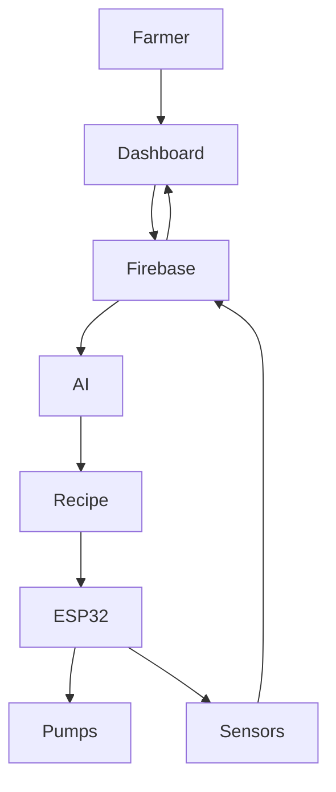

<div align="center">

# 🌱 ORIVA

### AI Powered Smart Hydroponic Nutrient Management Platform


### Intelligent • Automated • Cloud Connected • Precision Agriculture


---

### Smart Hydroponics using Artificial Intelligence + IoT

Automatically analyzes water chemistry, generates nutrient recipes, doses fertilizers, monitors crop health, and continuously optimizes hydroponic systems.

</div>

---

# 🎬 Overview

ORIVA is an AI-powered precision hydroponic nutrient management system designed for commercial farms, research laboratories, and controlled-environment agriculture.

Instead of relying only on EC and pH measurements, ORIVA analyzes the complete chemistry of the source water, understands crop-specific nutritional requirements, and automatically generates optimized fertilizer recipes.

The system integrates:

- 🌱 Crop Intelligence
- 🧠 AI Decision Engine
- 📊 Cloud Dashboard
- 📱 Mobile Application
- 📡 ESP32 Smart Controller
- ☁ Firebase Cloud
- 🤖 Automated Nutrient Dosing

---

# 🎯 Why ORIVA?

Traditional hydroponic controllers only monitor:

✔ EC

✔ pH

They **cannot answer:**

❌ Is this water suitable?

❌ Which nutrients are missing?

❌ Which fertilizer should be reduced?

❌ Can this water grow tomatoes?

❌ How much Calcium Nitrate should be added?

❌ How much Potassium Nitrate is already present?

ORIVA answers all of these automatically.

---

# 🚀 Key Features

✅ AI Water Suitability Analysis

✅ Crop-specific Nutrient Intelligence

✅ Automatic Fertilizer Recipe Generation

✅ Closed-loop Nutrient Dosing

✅ Real-time EC & pH Monitoring

✅ Stock Solution Management

✅ Water Chemistry Compensation

✅ Crop Growth Stage Management

✅ Cloud Data Logging

✅ Multi-user Dashboard

✅ Mobile Monitoring

✅ Firebase Synchronization

✅ Historical Analytics

✅ Notification System

✅ Multi Farm Management

---

# 🌍 System Overview



---

# 🧠 Intelligent Decision Pipeline


---

# 📷 System Architecture

```

                    Cloud

             +------------------+

             |    Firebase      |

             +------------------+

                     ▲

                     │

         +-----------+-----------+

         |                       |

         |                       |

 Dashboard                  Mobile App

         |                       |

         +-----------+-----------+

                     │

                 Internet

                     │

              ESP32 Controller

                     │

     +---------------+----------------+

     |               |                |

  Sensors        Dosing Pumps      Water Tank

```

---

# 📡 Hardware Components

| Component | Description |
|------------|-------------|
| ESP32 | Main Controller |
| EC Sensor | Nutrient Concentration |
| pH Sensor | Acidity Measurement |
| Water Temperature Sensor | Compensation |
| Water Level Sensor | Reservoir Monitoring |
| Peristaltic Pumps | Nutrient Dosing |
| Solenoid Valves | Water Control |
| Mixing Pump | Nutrient Mixing |

---

# 🌱 Hydroponic Workflow

```mermaid

graph LR

Water

-->

Water Analysis

-->

Crop Selection

-->

Recipe Generation

-->

Nutrient Mixing

-->

Reservoir

-->

Plants

-->

Sensor Feedback

-->

Dashboard

```

---

# 📊 AI Decision Engine

The ORIVA AI Engine performs:

✔ Water Suitability Analysis

✔ Crop Compatibility Assessment

✔ Nutrient Deficit Calculation

✔ Fertilizer Optimization

✔ EC Prediction

✔ pH Prediction

✔ Reservoir Compensation

✔ Smart Dosing Decisions

✔ Growth Stage Adaptation

✔ Historical Learning

---

# 🌾 Crop Intelligence

Supports

- Leafy Greens
- Herbs
- Tomatoes
- Cucumbers
- Peppers
- Melons
- Strawberries
- Root Crops
- Tropical Fruits
- Custom Crop Profiles

Each crop contains

- Growth stages
- Nutrient profile
- EC range
- pH range
- Environmental conditions
- Water suitability rules