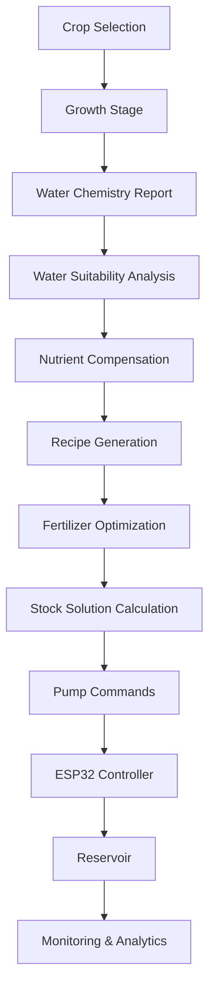
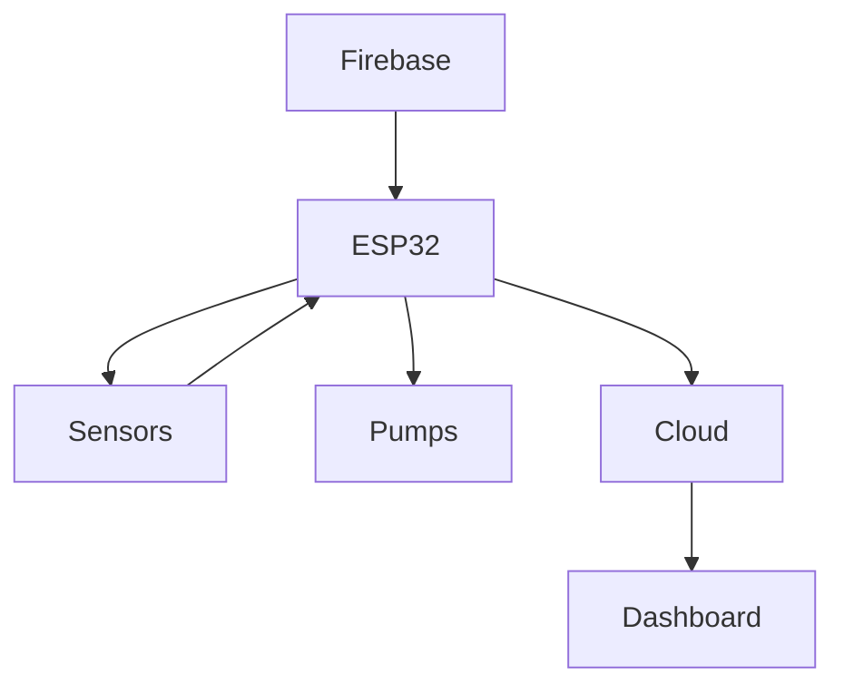

<div align="center">

# 🌱 HydroLogic

### Intelligent Hydroponic Nutrient Management Platform

<p align="center">

An AI-assisted hydroponic platform that analyzes water chemistry, generates crop-specific nutrient recipes, automates fertilizer dosing, and provides cloud-based monitoring and analytics.

</p>

<p align="center">


</p>

<p align="center">


</p>

---

### 🌿 Precision Agriculture • Artificial Intelligence • Internet of Things • Cloud Computing

*"Helping growers make data-driven nutrient decisions instead of relying only on EC and pH."*

</div>

---

# 📖 Overview

HydroLogic is an intelligent hydroponic nutrient management platform designed for controlled-environment agriculture.

Unlike conventional hydroponic controllers that only monitor Electrical Conductivity (EC) and pH, HydroLogic evaluates the complete chemistry of the source water, compensates for nutrients already present, generates crop-specific fertilizer recipes, and automates nutrient dosing using IoT-enabled hardware.

The project combines:

- 🧠 Intelligent decision making
- 🌱 Crop-specific nutrient intelligence
- 💧 Water chemistry analysis
- ⚙ Automated fertilizer dosing
- ☁ Cloud connectivity
- 📊 Real-time analytics
- 📱 Remote monitoring

---

# ✨ Key Features

✔ Crop-specific nutrient management

✔ Growth stage–based nutrient recipes

✔ Water suitability analysis

✔ Nutrient compensation using water chemistry

✔ Automatic fertilizer recipe generation

✔ Matrix-based fertilizer optimization

✔ Multi-tank dosing system

✔ Real-time EC monitoring

✔ Automatic pH correction

✔ Firebase cloud synchronization

✔ Multi-user dashboard

✔ Historical analytics

✔ Mobile notifications

✔ Device management

✔ Remote firmware updates

---

# 🎯 Why HydroLogic?

Traditional hydroponic systems typically control only two parameters:

- EC
- pH

However, two water samples can have the same EC while containing completely different minerals.

HydroLogic goes beyond simple EC control by answering questions such as:

✅ Is this water suitable for growing tomatoes?

✅ Which nutrients are already available?

✅ Which nutrients are deficient?

✅ Which fertilizers should be added?

✅ How much fertilizer is actually required?

✅ Can the existing water be used without treatment?

This enables more accurate nutrient management while reducing fertilizer waste.

---

# 🏗 System Architecture

```mermaid
graph LR

Farmer

-->

Dashboard

Dashboard

-->

Firebase

Firebase

-->

Decision Engine

Decision Engine

-->

Recipe Generator

Recipe Generator

-->

ESP32 Controller

ESP32 Controller

-->

Dosing Pumps

ESP32 Controller

-->

Sensors

Sensors

-->

Firebase

Firebase

-->

Dashboard
```

---

# 🚀 Complete Workflow


---

# 💡 Core Concept

HydroLogic follows a closed decision workflow.

```text
Water Chemistry
        │
        ▼
Crop Selection
        │
        ▼
Growth Stage
        │
        ▼
Water Suitability Analysis
        │
        ▼
Nutrient Compensation
        │
        ▼
Recipe Generation
        │
        ▼
Stock Solution Calculation
        │
        ▼
ESP32 Dosing Controller
        │
        ▼
Sensor Verification
        │
        ▼
Cloud Analytics
```

---

# 🌾 Supported Crop Categories

HydroLogic currently supports multiple crop families.

| Category | Examples |
|----------|----------|
| Leafy Greens | Lettuce, Spinach, Kale |
| Herbs | Basil, Mint, Parsley |
| Fruiting Crops | Tomato, Eggplant |
| Vining Crops | Cucumber, Melons |
| Peppers | Bell Pepper, Chilli |
| Root Crops | Carrot, Beetroot |
| Berries | Strawberry |
| Tropical Crops | Banana, Pineapple |

Each crop profile contains:

- Growth stages
- Target nutrient profile
- EC range
- pH range
- Environmental requirements
- Nutrient uptake model

---

# 🛠 Hardware Components

| Component | Purpose |
|------------|----------------------------|
| ESP32 | Main Controller |
| EC Sensor | Nutrient Concentration |
| pH Sensor | Acidity Measurement |
| Water Temperature Sensor | Temperature Compensation |
| Water Level Sensor | Reservoir Monitoring |
| Peristaltic Pumps | Nutrient Dosing |
| Mixing Pump | Nutrient Mixing |
| Solenoid Valve | Water Control |

---

# 📂 Repository Structure

```text
HydroLogic/

├── dashboard/
├── firmware/
├── mobile/
├── ai_engine/
├── docs/
│   ├── algorithms/
│   ├── hardware/
│   ├── images/
│   └── api/
├── firebase/
├── datasets/
└── README.md
```

---

# 🌍 Commercial Implementation

HydroLogic is the core intelligent nutrient management platform.

**ORIVA** is the commercial implementation built using HydroLogic, providing additional features such as product branding, deployment tools, and customer-facing services.

---
---

# 🧠 Intelligent Decision Engine

The HydroLogic Decision Engine is responsible for converting raw water chemistry data into an optimized hydroponic nutrient recipe.

Unlike conventional controllers that dose nutrients solely based on Electrical Conductivity (EC), HydroLogic performs a multi-stage analysis to determine **what nutrients are actually required** before initiating any dosing operation.

The engine consists of five independent modules:

| Module | Function |
|---------|----------|
| Water Analysis | Evaluates source water quality |
| Crop Intelligence | Loads crop-specific nutrient requirements |
| Nutrient Compensation | Calculates nutrients already available |
| Recipe Optimization | Determines fertilizer quantities |
| Dosing Controller | Converts recipe into pump commands |

---

# 🧠 Decision Pipeline



---

# 💧 Water Suitability Analysis

The first stage of the decision engine determines whether the uploaded water source is suitable for the selected crop.

Instead of simply checking EC, HydroLogic analyzes every major dissolved mineral.

---

## Parameters Evaluated

| Parameter | Purpose |
|------------|----------------------------|
| pH | Water Acidity |
| EC | Initial Salt Concentration |
| Calcium | Available Calcium |
| Magnesium | Available Magnesium |
| Potassium | Available Potassium |
| Sulfate | Sulfur Source |
| Nitrate | Available Nitrogen |
| Sodium | Harmful Salt Detection |
| Chloride | Toxicity Detection |
| Bicarbonates | Alkalinity |

---

## Water Analysis Workflow

```mermaid
graph LR

Water Report

-->

Extract Minerals

-->

Compare with Crop Profile

-->

Calculate Deficits

-->

Evaluate Harmful Ions

-->

Suitability Result
```

---

## Water Suitability Output

HydroLogic produces

- Water Suitability Score
- Crop Compatibility Score
- Nutrient Deficit Report
- Harmful Ion Warnings
- Water Treatment Recommendations

Example

```text
Source Water

★★★★★ Suitable

Available Nutrients

Ca ✔

Mg ✔

K ✔

Warnings

High Sodium

Recommendation

Blend with RO Water
```

---

# 🌿 Crop Intelligence Engine

Every crop contains an independent nutrient profile.

Each profile includes

- Growth stages
- Target EC
- Target pH
- Macro nutrients
- Micro nutrients
- Environmental limits

Example

```text
Tomato

↓

Fruiting Stage

↓

N = 140 ppm

P = 50 ppm

K = 300 ppm

Ca = 170 ppm

Mg = 65 ppm

S = 80 ppm
```

---

# 📊 Nutrient Compensation

The uploaded water already contains dissolved minerals.

Instead of adding the complete fertilizer recipe, HydroLogic subtracts the nutrients already available.

Example

Crop Target

```text
Calcium

170 ppm
```

Water Report

```text
Calcium

120 ppm
```

Required

```text
170 - 120

=

50 ppm
```

This process is repeated for every nutrient before recipe generation.

---

# 🧮 Recipe Generation Engine

Once the nutrient deficits are known, HydroLogic calculates the exact fertilizer quantities required.

Unlike traditional nutrient calculators, every fertilizer is solved simultaneously because each fertilizer contributes multiple nutrients.

---

## Fertilizers Supported

| Tank | Fertilizer |
|------|-----------------------|
| A | Calcium Nitrate |
| B | Potassium Nitrate |
| C | Monopotassium Phosphate |
| D | Magnesium Sulfate |
| E | Potassium Sulfate |
| F | Micronutrient Mix |
| G | pH Up |
| H | pH Down |

---

# ⚙ Matrix-Based Optimization

HydroLogic models fertilizer calculations as a system of linear equations.

Each fertilizer contributes to multiple nutrients.

For example

```text
Calcium Nitrate

↓

Nitrogen

+

Calcium
```

Potassium Nitrate

```text
↓

Nitrogen

+

Potassium
```

MKP

```text
↓

Phosphorus

+

Potassium
```

Instead of solving nutrients individually, the system solves all fertilizers simultaneously.

---

## Mathematical Model

```text
A × X = B
```

Where

A

Fertilizer Composition Matrix

X

Unknown Fertilizer Quantities

B

Required Nutrient Vector

The optimization engine calculates the fertilizer combination that satisfies all nutrient targets with minimum error.

---

## Optimization Workflow

```mermaid
flowchart LR

Required Nutrients

-->

Composition Matrix

-->

Linear Solver

-->

Optimized Fertilizer Mass

-->

Stock Solution Calculation
```

---

# 🧪 Stock Solution Calculator

The optimizer calculates fertilizer quantities in grams.

Since dosing pumps dispense liquids, HydroLogic converts fertilizer mass into stock solution volumes.

Example

```text
Required Calcium Nitrate

25 g
```

Stock Tank

```text
1000 g

↓

10 L
```

Concentration

```text
0.1 g/mL
```

Required Pump Volume

```text
25 ÷ 0.1

=

250 mL
```

This conversion is performed automatically for every fertilizer tank.

---

# 📡 ESP32 Controller

The ESP32 receives dosing commands from Firebase.

Its responsibilities include

- Reading sensors
- Operating dosing pumps
- Monitoring tank levels
- Mixing nutrient solution
- Uploading telemetry
- Firmware updates
- Wi-Fi communication

---

## ESP32 Workflow



---

# ☁ Firebase Cloud Platform

HydroLogic uses Firebase for cloud synchronization.

---

## Database Structure

```text
Users

└── Farms

      └── Devices

            └── Crop Profiles

            └── Water Reports

            └── Recipes

            └── Sensor Logs

            └── Dosing Logs

            └── Notifications

            └── Analytics
```

---

## Firebase Features

- User Authentication
- Multi-Farm Management
- Real-Time Database
- Cloud Storage
- Push Notifications
- Historical Data
- Device Synchronization

---

# 📈 Analytics Engine

HydroLogic continuously records operational data for long-term analysis.

### Dashboard Metrics

- Current EC
- Current pH
- Water Temperature
- Reservoir Volume
- Pump Activity
- Nutrient Consumption
- Water Consumption

---

### Historical Reports

- Daily Summary
- Weekly Summary
- Monthly Summary
- Crop Cycle Report

---

### AI Insights

The analytics engine estimates

- Fertilizer Usage
- Water Usage
- Nutrient Efficiency
- EC Stability
- pH Stability
- Estimated Yield Performance
- Operating Cost
- Resource Utilization

---

# 🔔 Notification Engine

The platform automatically alerts users when attention is required.

### Examples

🟢 Nutrient Tank Low

🟢 Reservoir Empty

🟢 High EC

🟢 Low EC

🟢 High pH

🟢 Low pH

🟢 Pump Failure

🟢 Sensor Offline

🟢 Water Unsuitable

🟢 Internet Disconnected

Notifications are available through

- Web Dashboard
- Mobile Application
- Email
- Push Notifications

---

# 🔄 End-to-End Platform Workflow

```mermaid
flowchart LR

Crop Selection

-->

Water Analysis

-->

Suitability Check

-->

Nutrient Compensation

-->

Recipe Optimization

-->

Stock Solution Calculation

-->

Pump Volume Calculation

-->

ESP32 Controller

-->

Reservoir Mixing

-->

Sensor Monitoring

-->

Cloud Analytics

-->

Farmer Dashboard
```

---

> **Note:** HydroLogic serves as the intelligent nutrient management platform. Commercial deployments, including branding, user management, and customer-specific services, can be implemented independently (e.g., under the ORIVA product ecosystem).